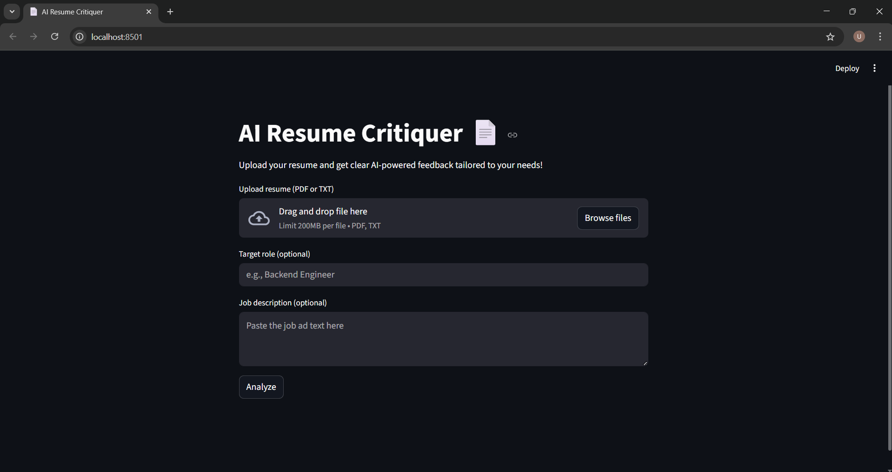

# AI-Resume-Critiquer-Agent
Agent that analyzes PDF/TXT resumes and returns clear, actionable feedback using OpenAI.



[](https://www.python.org/)
[](https://streamlit.io/)
[](https://docs.astral.sh/uv/)
[](LICENSE)

---

## Overview

Upload your resume (PDF or TXT), optionally add a target role and/or a job description, and receive a structured review with strengths, key improvements, rewritten bullet examples, and basic role/ATS alignment.

---

## Features

- 📄 Upload **PDF/TXT** resumes  
- 🎯 Optional **Target role** + **Job description** inputs  
- 🧠 OpenAI-powered feedback with clear sections (Markdown)  
- ⬇️ **Download** the result as a Markdown file  
- 🔐 API key is loaded **only from `.env`**

---

## Project Structure

```text
.
├─ app.py
├─ pyproject.toml
├─ .env.example
├─ README.md
├─ LICENSE
├─ .gitignore
└─ screenshot.png
```

---

## Prerequisites

- Python **3.10+**
- [uv](https://docs.astral.sh/uv/) installed (fast Python package & environment manager)
- An OpenAI API key

---

## Quick Start

1. **Create & sync the environment (uv)**
   ```bash
   uv venv
   uv sync
   
2. **Configure environment**
   ```bash
   cp .env.example .env
   # open .env and paste your real key:
   # OPENAI_API_KEY=sk-your-key-here

The app only reads the key from .env. There is no UI field for the API key.

3. **Run the app**
   ```bash
   uv run streamlit run app.py
   
Open the local URL that Streamlit prints (usually http://localhost:8501).

---

## Usage

1. Click “Upload resume (PDF or TXT)” and select your file.
2. (Optional) Enter a Target role and/or paste a Job description.
3. Click Analyze.
4. Review the feedback and Download results (Markdown).

---

## Configuration

- Environment variables (in .env):
```text
OPENAI_API_KEY=sk-your-key-here
```

- Dependencies are declared in pyproject.toml and installed by uv sync.

---

## Troubleshooting

- “OPENAI_API_KEY is missing”: \
  Ensure .env exists and contains OPENAI_API_KEY=....

- “Could not extract text”: \
  Your PDF may be image-only (scanned). Export a text-based PDF or provide a TXT file.

- Network / rate limit errors: \
  Try again later or check your OpenAI account usage and limits.

---

## License

This project is licensed under the MIT License.
```text
::contentReference[oaicite:0]{index=0}
```
